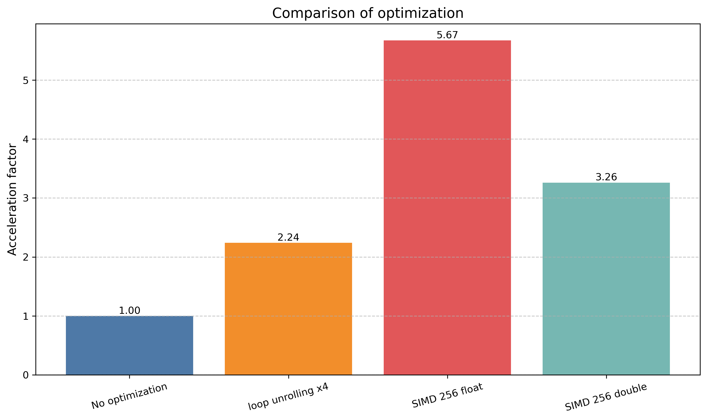

# Mandelbrot Set

Множество Мандельброта - множество точек c на комплексной плоскости, для которых рекуррентное соотношение z(n+1) = z(n)^2 + c при z(0) = 0 задаёт ограниченную последовательность. Иными словами, это множество таких c, для которых существует такое действительное R, что неравенство
|z(n)| < R выполняется при всех натуральных n.

Задача: отрисовка множества мандельброта с графическим выводом, с последующей оптимизацией через SIMD вычисления.
Для определения эффективности оптимизации проводилось тестирование с использоваланием интринсика rdtsc для подсчета числа тактов процессора на вычисления для заданного количества (100) кадров. Было протестировано два варианта вычислений через SIMD: для float и double на 256-битовых регистрах. Результаты представлены на диаграмме:

Наибольший прирост производительности наблюдается на версии с float (32 бита) - на каждой итерации цикла вычислений проводится расчет сразу для 8 пикселей, в то время как для double (64 бита) - 4, без оптимизации - только один.

В запущенном приложении можно перемещаться по изображению с помощью клавиш <kbd>W</kbd> <kbd>A</kbd> <kbd>S</kbd> <kbd>D</kbd>, а также увеличивать и уменьшать его с помощью <kbd>E</kbd> и <kbd>Q</kbd>.

Здесь просто примеры получившейся картинки.

