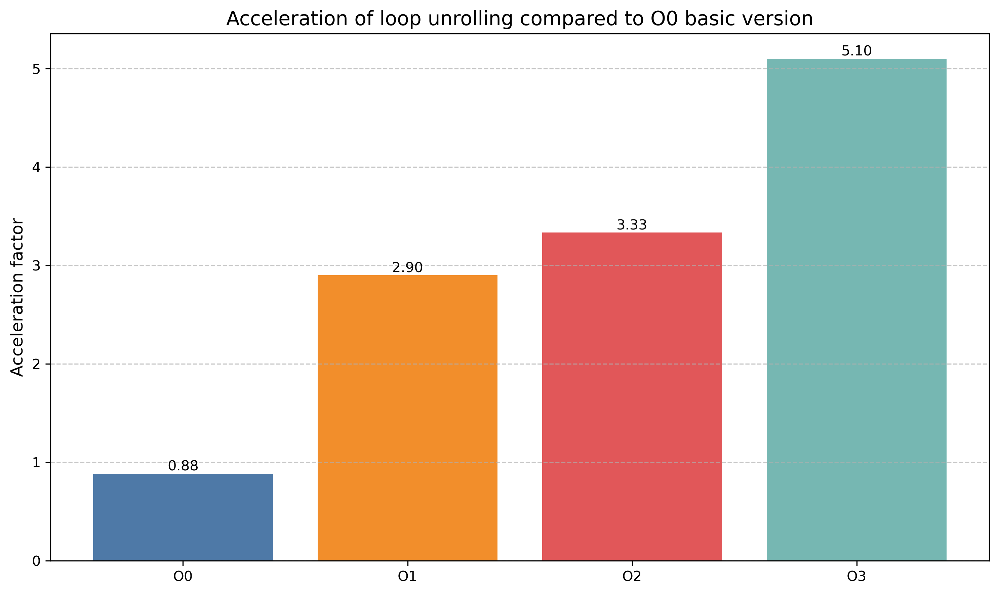
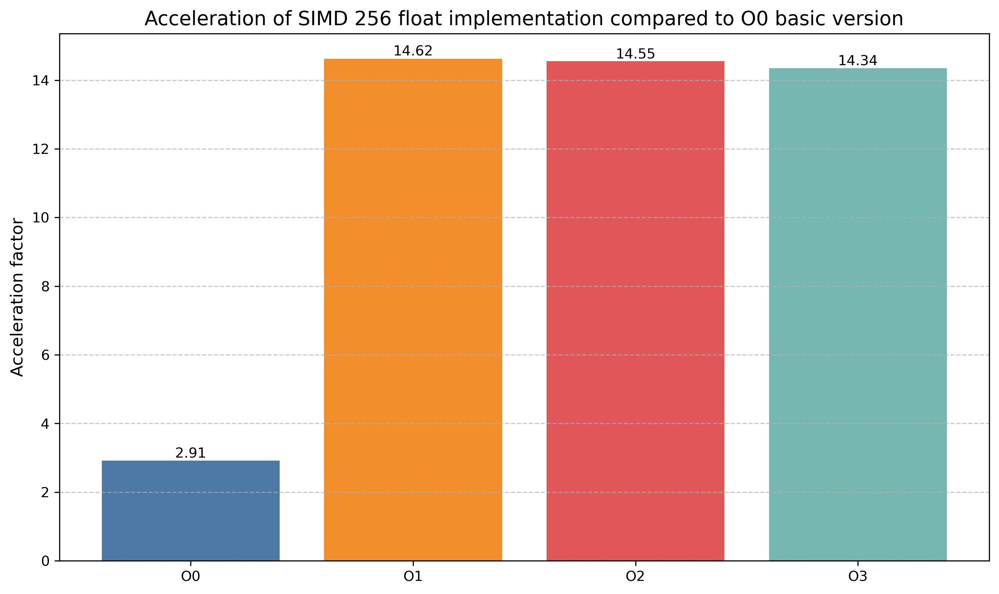
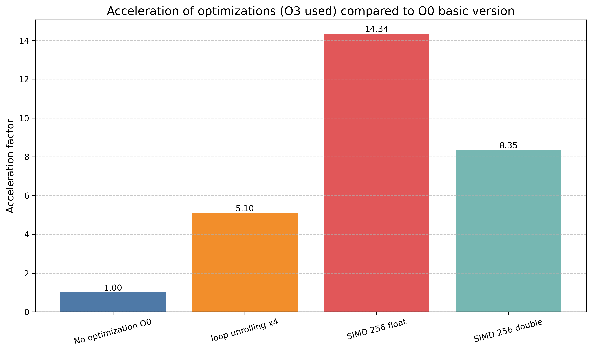
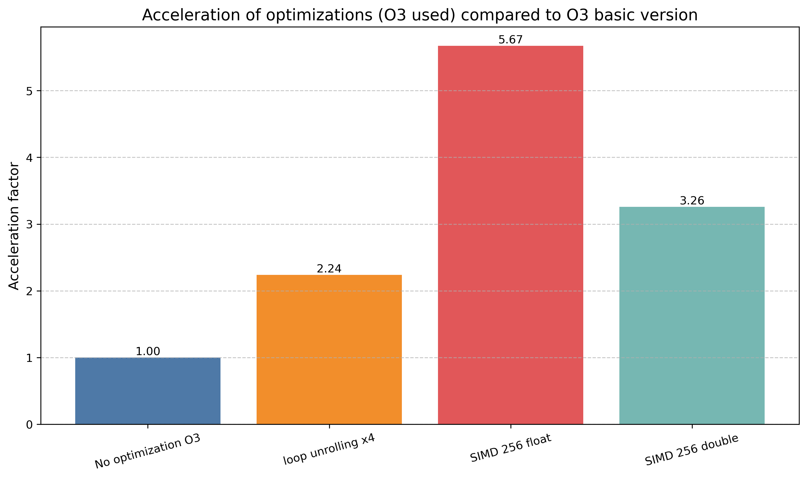
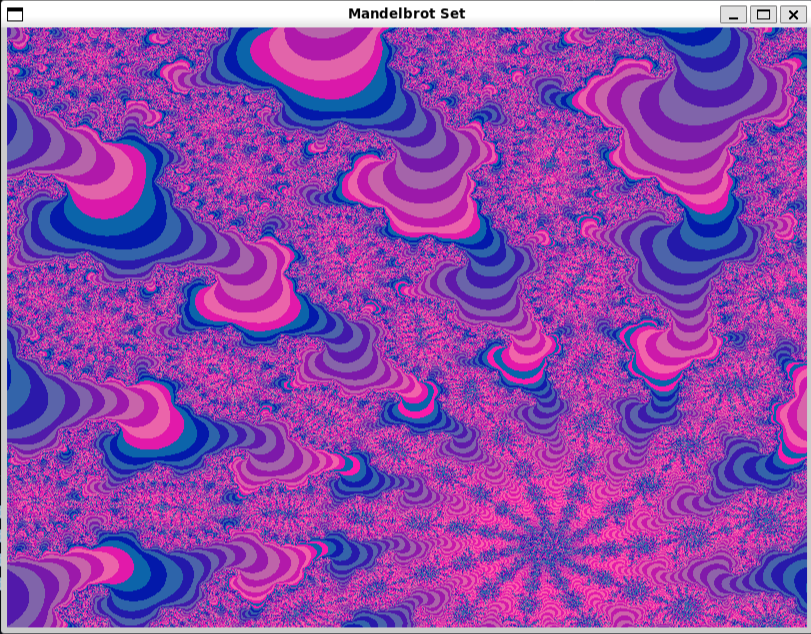

# Mandelbrot Set
- [Mandelbrot Set](#mandelbrot-set)
  - [Настройки системы](#настройки-системы)
  - [Изменение параметров программы](#изменение-параметров-программы)
    - [Что такое множество Мандельброта?](#что-такое-множество-мандельброта)
  - [Задание](#задание)
  - [Вычисления](#вычисления)
  - [Оптимизации](#оптимизации)
    - [результаты оптимизаций](#результаты-оптимизаций)
  - [Графика](#графика)
  - [Сборка](#сборка)

В данной работе использовались инструкции SIMD для оптимизации вычисления множества Мандельброта и сравнивалась производительность версии с SSE по сравнению с базовой версией без оптимизаций при компиляции с флагами -O0, -O1, -O2, -O3.

## Конфигурация

- **CPU**: AMD Ryzen 5 4600H with Radeon Graphics 3.00 GHz
- **OS**: Ubuntu 24.04.2 LTS (GNU/Linux 5.15.167.4-microsoft-standard-WSL2 x86_64)
- **Compiler**: g++ (Ubuntu 13.3.0-6ubuntu2~24.04) 13.3.0


## Изменение параметров программы

Изменение параметров графического приложения: [params.cpp](src/params.cpp)

Изменение параметров тестов: [computing_testing.cpp](src/computing_testing.cpp)

### Что такое множество Мандельброта?
Множество Мандельброта - множество точек {C} на комплексной плоскости, для которых рекуррентное соотношение z(n+1) = z(n)^2 + C задает ограниченную последовательность при z(0) = 0.

## Задание

Расчет и отрисовка точек множества Мандельброта.

## Вычисления

Для каждого пикселя на экране расчитывалась последовательность точек для соответсвующей ему точки C на комплексной плоскости согласно рекуррентной формуле: $$z(n+1) = z^2(n) + C$$ Если z(n) покидает окружность радиусом `R2_MAX = 10` или n превышает `MAX_ITER = 255`, вычисления прекращаются. Первый случай означает, что точка не принадлежит множеству Мандельброта, второй - наоборот. После этого по номеру N, на котором прекратился расчет, формируется цвет пикселя:

R = 50 + 70 * (1 - N / MAX_ITER) * ((N + 1) / 2) <br>
G = 25 + 75 * (N % 2) <br>
B = 170 <br>

[Открыть скрипт](src/computing.cpp)


## Оптимизации

Чтобы определить эффективность каждой из оптимизаций, измерялось время расчета 100 кадров с помощью `rdtsc`. Замеры проведены для SIMD на 256-битовых регистрах в двух вариантах: float32 double64, а также для варианта с массивами по 4 элемента (в таблицах обозначено как Loop Unrolling x4)

### Результаты оптимизаций

Повышение производительности по сравнению с базовой версией, скомпилированной с -O0:
Flages | No Optimization | Loop Unrolling x4 | SIMD 256 float | SIMD 256 double |
|-----|-----|-----|-----|-----|
| O0 | 1.0   | 0.884 | 2.911  | 1.657 |
| O1 | 2.661 | 2.899 | 14.625 | 8.358 |
| O2 |2.566  | 3.333 | 14.551 | 8.276 |
| O3 |2.567  | 5.099 | 14.344 | 8.353 |

Повышение производительности по сравнению с базовой версией, скомпилированной с соответствующим флагом в каждой строке:
Flages | Loop Unrolling x4 | SIMD 256 float | SIMD 256 double |
|-----|-----|-----|-----|
| O0 | 0.884| 2.911 | 1.657 |
| O1 | 1.089| 5.496 | 3.141 |
| O2 | 1.299| 5.671 | 3.226 |
| O3 | 1.987| 5.588 | 3.254 |



На следующих диаграммах заметно значительное повышение производительности SIMD инструкций при -O1 и больших оптимизациях:



Этот эффект станет понятен, если обратиться к  [godbolt](https://godbolt.org/z/rhPbzj8c4).
Фрагмент программы:

При компиляции с -O0 происходит множество промежуточных сохранений регистров и чтений обратно в регистры (тело цикла for заканчивается на строке 223):
```asm
147     .L28:
148     vmovaps ymm0, YMMWORD PTR [rbp-112]
149     vmovaps YMMWORD PTR [rbp-720], ymm0
150     vmovaps ymm0, YMMWORD PTR [rbp-112]
151     vmovaps YMMWORD PTR [rbp-752], ymm0
...
228     add     QWORD PTR [rbp-184], 1
229 .L13:
230     cmp     QWORD PTR [rbp-184], 254
231     jbe     .L28
232     jmp     .L20
233 .L33:
234     nop
235 .L20:
```

При этом при компиляции с -O2 регистры используюся эффективно, без излишних сохранений:

```asm
.L16:
        vsubps  ymm1, ymm1, ymm5
        vaddps  ymm2, ymm2, ymm2
        vandps  ymm0, ymm0, YMMWORD PTR .LC7[rip]
        vsubps  ymm7, ymm7, ymm0
        vaddps  ymm2, ymm2, ymm3
        vaddps  ymm0, ymm1, ymm6
        sub     rax, 1
        je      .L2
.L3:
        vmulps  ymm5, ymm2, ymm2
        vmulps  ymm1, ymm0, ymm0
        vmulps  ymm2, ymm0, ymm2
        vaddps  ymm0, ymm1, ymm5
        vcmpps  ymm0, ymm0, ymm4, 17
        vmovmskps       esi, ymm0
        test    esi, esi
        jne     .L16
.L2:
```


Таким образом использование SIMD инструкции при компиляции с -O0 крайне неэффективно.

Финальное сравненние оптимизаций и базовой версии, все скомпилированы с -O3:




Наибольший прирост производительности наблюдается в версии SIMD с float32 - здесь на каждой итерации цикла расчитываюся параметры сразу для 8 пикселей, в то время как в версии SIMD с double64 - только для 4.

## Графика

В запущенном приложении можно передвигаться по изображению с помощью <kbd>W</kbd> <kbd>A</kbd> <kbd>S</kbd> <kbd>D</kbd>, а также приближать его или удалять, используя <kbd>E</kbd> and <kbd>Q</kbd>.




## Сборка

Для компиляции основной - наиболее производительной версии:

```shell
make compile
```
Для компиляции всех версий (с -O0, ..., -O3):

```shell
make compile_On
```
Запуск основной версии:

```shell
make run
```

Тестирование всех версий:

```shell
make run_tests
```
Программу можно запускать с двумя опциями:
1) Графический режим

```shell
./mandelbrot-set --graph
```

1) Тестирование конкретной версии: --testing={число тестов - 100 по умолчанию}

```shell
./mandelbrot-set --testing=100
```
