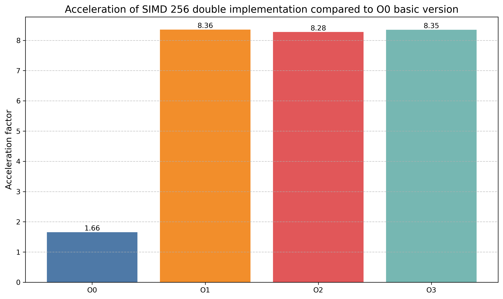
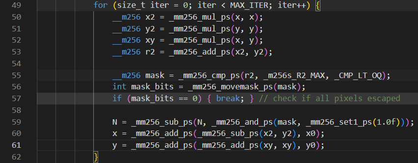
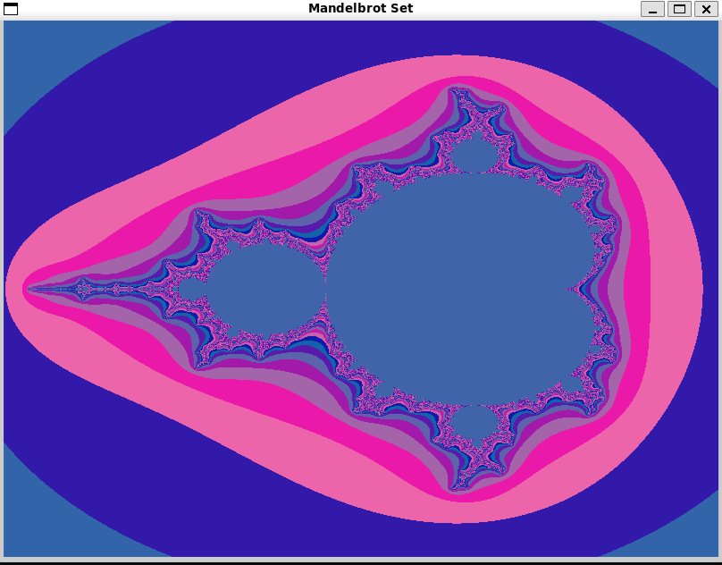

# Mandelbrot Set
- [Mandelbrot Set](#mandelbrot-set)
    - [What is Mandelbrot-set?](#what-is-mandelbrot-set)
  - [Task](#task)
  - [Calculations](#calculations)
  - [Optimizations](#optimizations)
    - [acceleration testing results](#acceleration-testing-results)
  - [Graphical mode](#graphical-mode)
  - [Test setup](#test-setup)
  - [Compiling and running](#compiling-and-running)
  - [Changing parameters of programm](#changing-parameters-of-programm)

This work is focused on implementing two main optimizations - loop unrolling and usage of SIMD instructions - in programm for computing Mandelbrot-set and comparing its perfomance, also testing the effect of optimized versions compiled with -O0, -O1, -O2, -O3 flags.

### What is Mandelbrot-set?
The Mandelbrot set is the set of points C in the complex plane for which the recurrence relation z(n+1) = z(n)^2 + C at z(0) = 0 defines a bounded sequence. In other words, it is the set of C for which there exists a real R such that the inequality
|z(n)| < R holds for all natural n.

## Task

 Drawing the Mandelbrot set with graphical output, followed by optimization via SIMD calculations.

## Calculations

For each pixel in the displayed window, a sequence of points on the complex plane is calculated, starting from the point C corresponding to the pixel, using the recursive formula z(n+1) = z(n)^2 + C, until the iteration number N exceeds MAX_ITER = 255 or z(N) leaves the circle with the center at the origin of fixed radius (10). The resulting number N is converted to RGBA in a certain way to display the Mandelbrot set, RGBA are written to an array for subsequent rendering.

## Optimizations

To determine the efficiency of the optimization, testing was carried out using the rdtsc intrinsic to count the number of processor cycles for calculations for a given number (100) of frames. While testing, graphics were disabled, only time of calculations was measured. Two variants of calculations via SIMD were tested: for float and double on 256-bit ymm registers. The results are represented in the tables and diagrams:

### acceleration testing results

Accelaration compared with basic version (No Optimization) compiled with O0:
Flages | No Optimization | Loop Unrolling x4 | SIMD 256 float | SIMD 256 double |
|-----|-----|-----|-----|-----|
| O0 | 1.0   | 0.884 | 2.911  | 1.657 |
| O1 | 2.661 | 2.899 | 14.625 | 8.358 |
| O2 |2.566  | 3.333 | 14.551 | 8.276 |
| O3 |2.567  | 5.099 | 14.344 | 8.353 |

Accelaration compared with basic version compiled with the matching flags for each column:
Flages | Loop Unrolling x4 | SIMD 256 float | SIMD 256 double |
|-----|-----|-----|-----|
| O0 | 0.884| 2.911 | 1.657 |
| O1 | 1.089| 5.496 | 3.141 |
| O2 | 1.299| 5.671 | 3.226 |
| O3 | 1.987| 5.588 | 3.254 |


On the following diagrams for version with usage of SIMD instructions we notice significant increase in perfomance after just O1:


This effect can be explained if we look at assemble code after compiling with O0 and O2. Lets look at the following fragment of programm and what assembly code will produce [godbolt](https://godbolt.org/).
Fragment of programm:


In version with O0, it is easy to see how many unnecessary operations of memory usage left in code (for body ends on line 223):


While in O2 ymm registers are used effectively:


Therefore there is not much sense in using SIMD instructions without compiler optimizations.

Final comparison of optimizations compiled with O3:


The greatest performance gain is observed in the version with float (32 bits) - at each iteration of the calculation cycle, calculations are performed for 8 pixels at once, while for double (64 bits) - 4, without optimization - only one.

## Graphical mode

In the running application, you can navigate the image using the keys <kbd>W</kbd> <kbd>A</kbd> <kbd>S</kbd> <kbd>D</kbd>, and also zoom in and out using <kbd>E</kbd> and <kbd>Q</kbd>.




## Test setup

- **CPU**: AMD Ryzen 5 4600H with Radeon Graphics 3.00 GHz
- **OS**: Ubuntu 24.04.2 LTS (GNU/Linux 5.15.167.4-microsoft-standard-WSL2 x86_64)
- **Compiler**: g++ (Ubuntu 13.3.0-6ubuntu2~24.04) 13.3.0

## Compiling and running

For compiling main fastest version

```shell
make compile
```

For compiling all version (-O0, ..., -O3)

```shell
make compile_On
```

For running main version

```shell
make run
```


For running tests on all versions

```shell
make run_tests
```
There are two options for running my programm:
1) Running graphical application

```shell
./mandelbrot-set --graph
```

2) Running tests of computing functions with number of tests from --testing option argument (100 as a default)

```shell
./mandelbrot-set --testing=100
```

## Changing parameters of programm

If you want to change parameters of graphical application, view  `/src/params.cpp`. For changing parameters of testing, view `/src/computing_testing.cpp`: in the beginning of this file there are *Funcs_for_test* - array of computing functions to test, *benchmark_index* - index of funtion in *Funcs_for_test* all other functions perfomance will be compared with, *dump_file_name* - name for testing results (will be stored in `/dump` directory).
